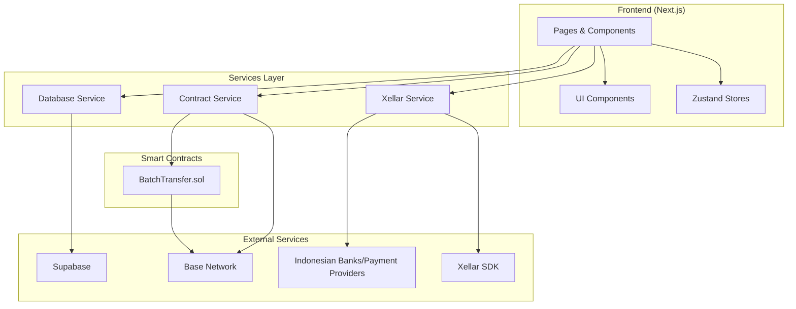
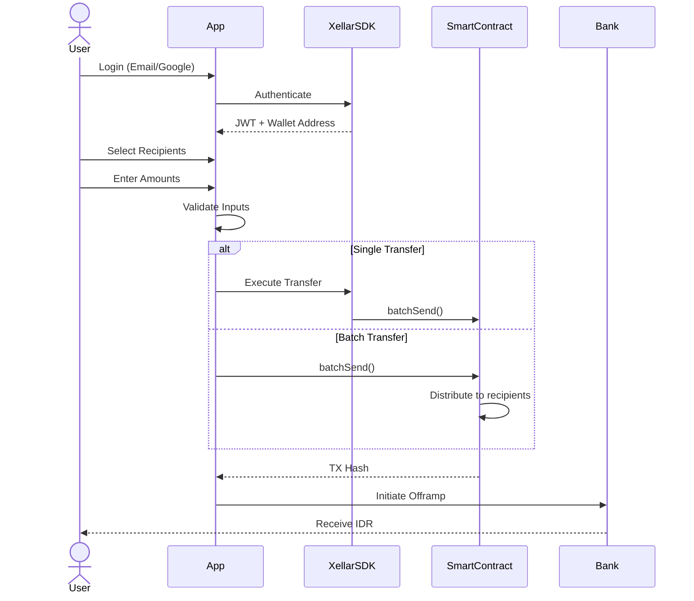
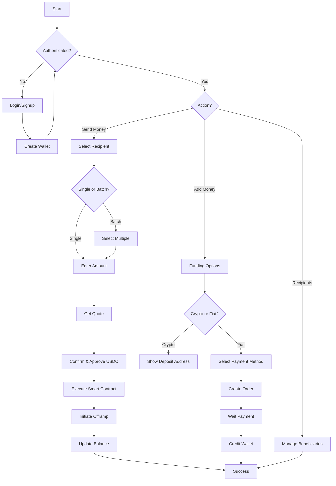
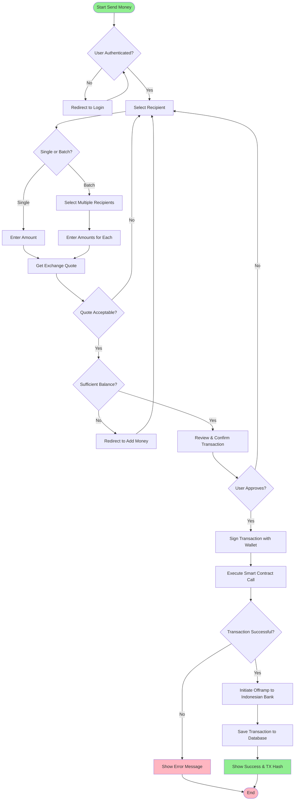
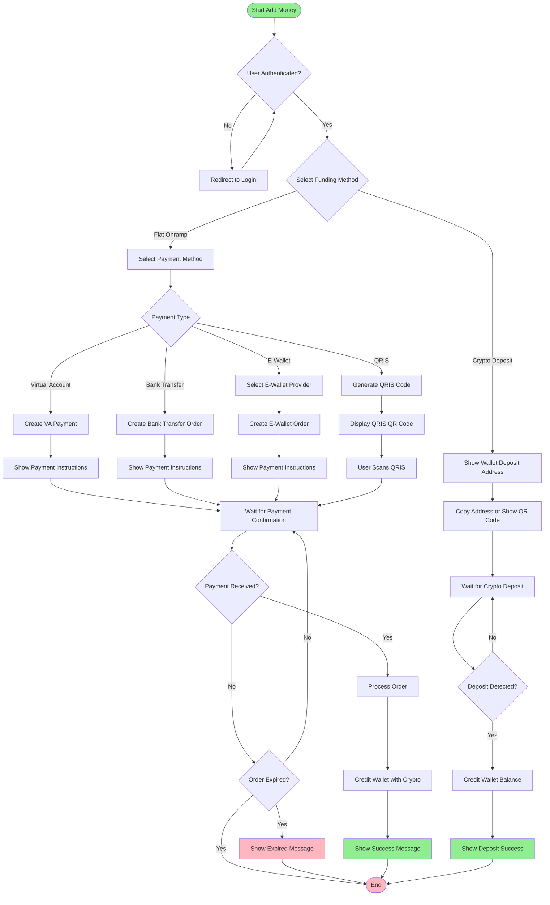
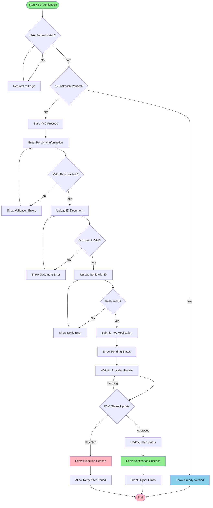
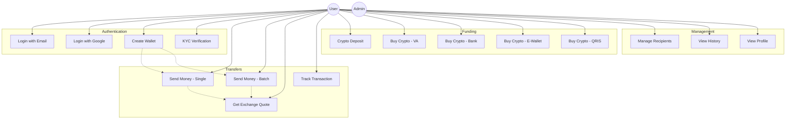

# Remmitt - Cross-Border Remittance Platform

A modern blockchain-powered remittance platform for sending money from the US to Indonesia. Built with Next.js 16, React 19, and integrated with the Base network for fast, low-cost transactions.

## Overview

Remmitt enables users to send USD to Indonesian Rupiah (IDR) using cryptocurrency rails. The platform supports both single and batch transfers, with gas-optimized smart contracts handling multiple recipients in a single transaction.

**Target Market:** Indonesian remittance corridor (USD USD → IDR)

**Key Benefits:**

- 1% transfer fee (vs. 5-10% traditional)
- 15-60 minute delivery time
- Support for up to 200 recipients per batch
- Multiple funding options (crypto, VA, bank, e-wallet, QRIS)

## Features

### Authentication

- Email/OTP login
- Google OAuth integration
- Embedded wallet creation via Xellar SDK

### Transfers

- **Single Transfer:** Send to one recipient
- **Batch Transfer:** Send to up to 200 recipients in one transaction
- Real-time exchange quotes
- Transaction tracking and history

### Funding Options

- **Crypto Deposit:** Direct USDC deposit to wallet address
- **Fiat Onramp:** Buy crypto via:
  - Virtual Account (VA)
  - Bank Transfer
  - E-wallet (GoPay, OVO, Dana, ShopeePay)
  - QRIS

### Recipients

- Add and manage beneficiaries
- Bank and e-wallet support
- Favorite recipients for quick access
- Transaction history per recipient

### Additional Features

- Transaction history with filters
- In-app notifications
- KYC verification flow
- Security settings
- Help center

## Tech Stack

### Frontend

- **Framework:** Next.js 16.0.10
- **UI Library:** React 19.2.0
- **Language:** TypeScript 5
- **Styling:** Tailwind CSS 4.1.9
- **Components:** Radix UI primitives
- **State Management:** Zustand
- **Forms:** React Hook Form + Zod validation
- **Charts:** Recharts

### Blockchain

- **SDK:** Xellar SDK v4.8.0
- **Network:** Base (Ethereum L2)
- **Web3 Library:** Viem 2.44.4
- **Smart Contracts:** Solidity 0.8.20 (Foundry)

### Backend/Database

- **Database:** Supabase (PostgreSQL)
- **Client:** @supabase/supabase-js v2.88.0

## Architecture

### System Architecture



### Sequence Diagram



### User Flow



### Activity Diagrams

#### Send Money Flow



#### Add Money (Funding) Flow



#### KYC Verification Flow



### Use Case Diagram



## Smart Contracts

### BatchTransfer.sol

Gas-optimized contract for sending tokens to multiple recipients in a single transaction.

#### Deployment

| Network                | Chain ID | Address                                      | Explorer                                                                                            |
| ---------------------- | -------- | -------------------------------------------- | --------------------------------------------------------------------------------------------------- |
| Base Sepolia (Testnet) | 84532    | `0xca60bFd1D0eAfDf051885221ec4DF0510ceee944` | [View on Basescan](https://sepolia.basescan.org/address/0xca60bFd1D0eAfDf051885221ec4DF0510ceee944) |
| Base Mainnet           | 8453     | TBD                                          | -                                                                                                   |

#### Functions

| Function                                                            | Description                            |
| ------------------------------------------------------------------- | -------------------------------------- |
| `batchSend(address token, address[] recipients, uint256[] amounts)` | Send tokens to multiple recipients     |
| `estimateGas(uint256 recipientCount)`                               | Estimate gas cost for batch transfer   |
| `MAX_RECIPIENTS()`                                                  | Returns 200 (max recipients per batch) |
| `emergencyWithdraw(address token, uint256 amount)`                  | Owner-only emergency withdraw          |

#### Token Addresses

| Token | Testnet                                      | Mainnet                                      |
| ----- | -------------------------------------------- | -------------------------------------------- |
| USDC  | `0x036CbD53842c5426634e7929541eC2318f3dCF7e` | `0x833589fCD6eDb6E08f4c7C32D4f71b54bdA02913` |

#### Gas Cost Estimate

- **Base Gas:** 50,000 gas
- **Per Recipient:** ~35,000 gas
- **Example (10 recipients):** ~400,000 gas

## Project Structure

```
web/
├── app/                          # Next.js 16 App Router
│   ├── page.tsx                  # Landing/login page
│   ├── dashboard/                # Main dashboard
│   ├── send/                     # Single & batch transfers
│   ├── add-money/                # Funding options
│   │   ├── crypto/               # Crypto deposit
│   │   └── onramp/               # Fiat onramp
│   ├── recipients/               # Manage beneficiaries
│   ├── history/                  # Transaction history
│   ├── notifications/            # In-app notifications
│   ├── profile/                  # User profile & KYC
│   ├── security/                 # Security settings
│   └── help/                     # Help center
│
├── components/                   # React components
│   ├── send/                     # Transfer components
│   ├── dashboard/                # Dashboard widgets
│   ├── auth/                     # Authentication components
│   └── ui/                       # Reusable UI components (shadcn)
│
├── lib/                          # Utilities & helpers
│   ├── batch-contract.ts         # Batch contract integration
│   ├── constants/                # Constants (tokens, networks)
│   ├── supabase.ts               # Supabase client
│   └── __tests__/                # Unit tests
│
├── services/                     # Business logic layer
│   ├── contract-service.ts       # Smart contract interactions
│   ├── database-service.ts       # Database operations
│   └── xellar-service.ts         # Xellar SDK wrapper
│
├── store/                        # Zustand state stores
│   ├── auth-store.ts             # Authentication state
│   ├── wallet-store.ts           # Wallet state
│   └── recipient-store.ts        # Recipients state
│
├── config/                       # Configuration files
│   └── xellar.config.ts          # Xellar SDK config
│
└── supabase-schema.sql           # Database schema
```

## Getting Started

### Prerequisites

- Node.js 18+
- pnpm (recommended) or npm/yarn
- Supabase account (for database)
- Xellar API credentials

### Installation

1. **Clone the repository**

```bash
git clone https://github.com/yourusername/remmitt.git
cd remmitt/web
```

2. **Install dependencies**

```bash
pnpm install
```

3. **Set up environment variables**

Create a `.env.local` file in the root:

```env
# Supabase
NEXT_PUBLIC_SUPABASE_URL=your_supabase_project_url
NEXT_PUBLIC_SUPABASE_ANON_KEY=your_supabase_anon_key

# Xellar SDK
NEXT_PUBLIC_XELLAR_API_KEY=your_xellar_api_key
NEXT_PUBLIC_XELLAR_PROJECT_ID=your_project_id

# Network Configuration
NEXT_PUBLIC_ENABLE_TESTNET=true    # Set to false for mainnet

# Application
NEXT_PUBLIC_APP_URL=http://localhost:3000
```

4. **Set up Supabase database**

Run the schema SQL in your Supabase SQL Editor:

```bash
cat supabase-schema.sql | pbcopy  # Copy to clipboard
# Then paste in Supabase SQL Editor
```

5. **Run development server**

```bash
pnpm dev
```

Open [http://localhost:3000](http://localhost:3000) in your browser.

## Environment Variables

| Variable                        | Description            | Required |
| ------------------------------- | ---------------------- | -------- |
| `NEXT_PUBLIC_SUPABASE_URL`      | Supabase project URL   | Yes      |
| `NEXT_PUBLIC_SUPABASE_ANON_KEY` | Supabase anonymous key | Yes      |
| `NEXT_PUBLIC_XELLAR_API_KEY`    | Xellar SDK API key     | Yes      |
| `NEXT_PUBLIC_XELLAR_PROJECT_ID` | Xellar project ID      | Yes      |
| `NEXT_PUBLIC_ENABLE_TESTNET`    | Enable testnet mode    | Yes      |
| `NEXT_PUBLIC_APP_URL`           | Application URL        | No       |

## Pages & Routes

| Route               | Purpose                                |
| ------------------- | -------------------------------------- |
| `/`                 | Landing & login                        |
| `/dashboard`        | Main dashboard with balance overview   |
| `/send`             | Single & batch money transfers         |
| `/add-money`        | Funding options (crypto/onramp)        |
| `/add-money/crypto` | Crypto deposit address                 |
| `/add-money/onramp` | Fiat onramp (VA, bank, e-wallet, QRIS) |
| `/recipients`       | Manage beneficiaries                   |
| `/history`          | Transaction history                    |
| `/notifications`    | In-app notifications                   |
| `/profile`          | User profile settings                  |
| `/profile/verify`   | KYC verification                       |
| `/security`         | Security settings (2FA, password)      |
| `/help`             | Help center & FAQs                     |
| `/terms`            | Terms of service                       |

## Fee Structure

| Service                | Fee                     |
| ---------------------- | ----------------------- |
| Transfer Fee           | 1% of transfer amount   |
| Onramp (VA)            | 1.0%                    |
| Onramp (Bank Transfer) | 1.2%                    |
| Onramp (E-wallet)      | 1.5%                    |
| Onramp (QRIS)          | 1.8%                    |
| Gas (Base Network)     | ~$0.001 per transaction |

## API Integration

### Xellar SDK

The Xellar SDK provides embedded wallet functionality and blockchain interactions.

```typescript
import { getXellarClient } from "@/config/xellar.config";

const client = getXellarClient();

// Authenticate
const user = await client.authenticate(email, otp);

// Get wallet address
const address = await client.getWalletAddress();

// Send transaction
const txHash = await client.wallet.sendTransaction({
  to: contractAddress,
  data: callData,
});
```

### Supabase Database

```typescript
import { supabase } from "@/lib/supabase";

// Get user recipients
const { data } = await supabase
  .from("recipients")
  .select("*")
  .eq("user_id", userId);

// Create transaction
const { data } = await supabase.from("transactions").insert({
  user_id: userId,
  amount: 100,
  recipient_name: "John Doe",
  // ...
});
```

### Smart Contract Interaction

```typescript
import { executeBatchTransfer } from "@/lib/batch-contract";

const result = await executeBatchTransfer(xellarClient, {
  recipients: [
    { id: "1", name: "Alice", walletAddress: "0x..." },
    { id: "2", name: "Bob", walletAddress: "0x..." },
  ],
  amounts: [100, 200], // USD amounts
});
```

## Supported Indonesian Banks

- Bank Central Asia (BCA)
- Bank Mandiri
- Bank Rakyat Indonesia (BRI)
- Bank Negara Indonesia (BNI)
- CIMB Niaga
- Bank Danamon
- Bank Permata
- And more...

## Supported E-wallets

- GoPay
- OVO
- Dana
- ShopeePay
- LinkAja

## Development

### Running Tests

```bash
pnpm test
```

### Building for Production

```bash
pnpm build
```

### Linting

```bash
pnpm lint
```

## Deployment

### Vercel (Recommended)

1. Connect your GitHub repository to Vercel
2. Add environment variables in Vercel dashboard
3. Deploy

### Manual Deployment

```bash
pnpm build
pnpm start
```

## Security Considerations

- All contract calls require user approval via Xellar SDK
- USDC approval required before batch transfers
- Row Level Security (RLS) enabled on Supabase tables
- KYC verification for high-volume users
- Emergency withdraw function for contract owner

## Contributing

1. Fork the repository
2. Create a feature branch (`git checkout -b feature/amazing-feature`)
3. Commit your changes (`git commit -m 'Add amazing feature'`)
4. Push to the branch (`git push origin feature/amazing-feature`)
5. Open a Pull Request

## License

This project is licensed under the MIT License.

## Support

For support, email support@remmitt.com or join our Discord community.

---

**Built with** for the Indonesian diaspora community.
